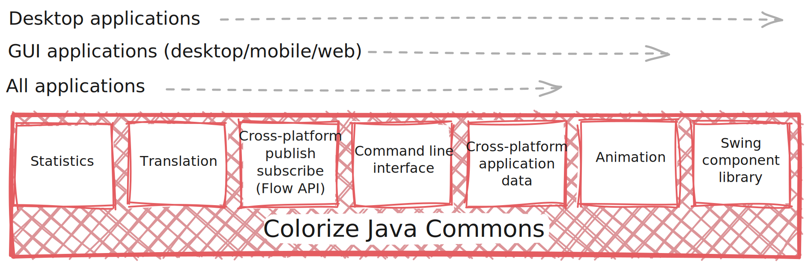

Colorize Java Commons
=====================

Set of Java libraries for web, desktop, and mobile applications. It is used in all Java-based
applications and libraries developed by [Colorize](http://www.colorize.nl), where it has been
in use since 2007.

The library focuses on portability, and supports a wide variety of platforms and environments.
It can be used in back-end applications, in cloud environments, in desktop applications on 
Windows/Mac/Linux, in mobile apps on Android and iOS, and in the browser (via
[TeaVM](http://teavm.org)).

The reason for this large variety of environments is that the library started out as a foundation 
for cross-platform desktop applications. It was later adopted for back-end applications, and
now supports both scenarios.

Usage
-----

The library is available from the Maven Central repository. To use it in a Maven project, add it 
to the dependencies section in `pom.xml`:

    <dependency>
        <groupId>nl.colorize</groupId>
        <artifactId>colorize-java-commons</artifactId>
        <version>2024.1</version>
    </dependency>
    
The library can also be used in Gradle projects:

    dependencies {
        implementation "nl.colorize:colorize-java-commons:2024.1"
    }
    
Documentation
-------------

- [JavaDoc](http://api.clrz.nl/colorize-java-commons/)

Usage examples
--------------

### Command line interface

The `CommandLineArgumentParser` can be used to define and parse arguments for command line
applications. It uses an approach that is quite different from the annotation-based approach
used by [Args4j](https://github.com/kohsuke/args4j), which is excellent but has not been updated
since 2016.

The following example shows how to define a simple command line interface:

    public class MyApp {
        @Arg(name = "--input", usage = "Input directory")
        public File inputDir

        @Arg(name = "--output", defaultValue = "/tmp", usage = ""Output directory")
        public File outputDir;

        @Arg
        public boolean overwrite;

        public static void main(String[] argv) {
            CommandLineArgumentParser argParser = new CommandLineArgumentParser(MyApp.class);
            MyApp app = argParser.parse(argv, MyApp.class);
        }
    }

### Swing component library

Refer to `CustomComponentsUIT` for an example application. `MacIntegrationUIT` contains an example
application that shows integration with some Mac system functionality.

### Animation framework

Refer to `InterpolationUIT` for an interactive example. The following example creates a timeline
that moves the ball across the screen in 0.4 seconds, using easing animation interpolation:

    Timeline anim = new Timeline(Interpolation.EASE)
        .addKeyFrame(0f, 0f);
        .addKeyFrame(0.4f, 800f);

The timeline can then be used for animation. The following example shows how to animate a Swing
component's background color from red to blue:

    JPanel target = new JPanel();
    target.setOpaque(true);
    target.setBackground(Color.RED);
    target.setPreferredSize(new Dimension(200, 200));
    
    JButton animateButton = new JButton("Animate background color");
    animateButton.addActionListener(e -> animator.animateBackgroundColor(target, Color.BLUE, 1f));

Build instructions
------------------

Building the library requires the following:

- [Java JDK](http://java.oracle.com) 21+
- [Gradle](http://gradle.org)

The following Gradle build tasks are available:

- `gradle clean` cleans the build directory
- `gradle assemble` creates the JAR file for distribution
- `gradle test` runs all unit tests
- `gradle coverage` runs all unit tests and reports on test coverage
- `gradle javadoc` generates the JavaDoc API documentation
- `gradle dependencyUpdates` checks for and reports on library updates
- `gradle publish` publishes the library to Maven central
  (requires the Gradle properties `mavenCentralUser` and `mavenCentralPassword`)

License
-------

Copyright 2007-2023 Colorize

> Licensed under the Apache License, Version 2.0 (the "License");
> you may not use this file except in compliance with the License.
> You may obtain a copy of the License at
>
>    http://www.apache.org/licenses/LICENSE-2.0
>
> Unless required by applicable law or agreed to in writing, software
> distributed under the License is distributed on an "AS IS" BASIS,
> WITHOUT WARRANTIES OR CONDITIONS OF ANY KIND, either express or implied.
> See the License for the specific language governing permissions and
> limitations under the License.
